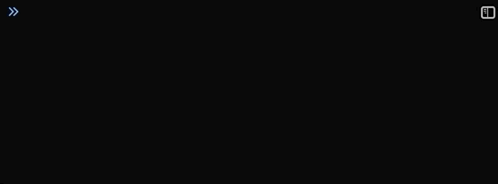

[](https://www.npmjs.com/package/@khoifish/share-loader)
[](https://www.npmjs.com/package/@khoifish/share-loader)
[](https://www.npmjs.com/package/@khoifish/share-loader/blob/master/LICENSE)

<div align="center">
  <!-- replace with accurate logo e.g from https://worldvectorlogo.com/ -->
  <a href="https://github.com/webpack/webpack">
    
  </a>
  <h1>Share Loader</h1>
  <p>The share loader allows you to share modules between webpack builds via a global namespace<p>
</div>

<h2 align="center">Install</h2>

```bash
yarn add share-loader --save-dev
```

<h2 align="center"><a href="https://webpack.js.org/concepts/loaders">Usage</a></h2>

Webpack config of the core/host application

```js
module: {
  rules: [
    {
      test: /\.js?$/,
      use: [
        {
          loader: 'share-loader',
          options: {
            modules: ['@material-ui/core', 'react', 'react-dom'],
            namespace: 'some-name-space',
          },
        },
      ],
    },
  ]
}
```

Webpack config of consumer apps

```js
const { Externals } = require('share-loader')

externals: [
  Externals({
    namespace: 'some-name-space',
    modules: ['@material-ui/core', 'react']
  })
],
output: {
  library: ['some-name-space', packageJson.name],
  libraryTarget: 'umd'
}
```

You can see your shared dependencies in the Window object under the namespace variable you declared in your Webpack config.



<h2 align="center">Demo</a></h2>

### core-app

1. In the root folder, `cd` into `core-app`
2. Run `yarn install`
3. Run `yarn dev`
4. This will spin up a local dev server on `localhost:1234`

### feature-app

1. In a seperate terminal window, `cd` into `feature-app`
2. Run `yarn install`
3. Run `yarn serve`
4. This will spin up a local server on `localhost:4567` and allow you to access the built JS file via `localhost:4567/feature-app.js`
5. There is also a `yarn dev` command to allow you to make whatever changes you need.

### Combining the Two

1. Go to `localhost:1234`
2. Click on `Feature 1` in the top nav bar
3. Watch as `core-app` pulls in `feature-app.js` and dynamically loads the page (you can see this in your browser's network tab)

### Notes

- If you make changes in the feature app and they are not being reflected in the core app, make sure you disable caching in your browser's console.
